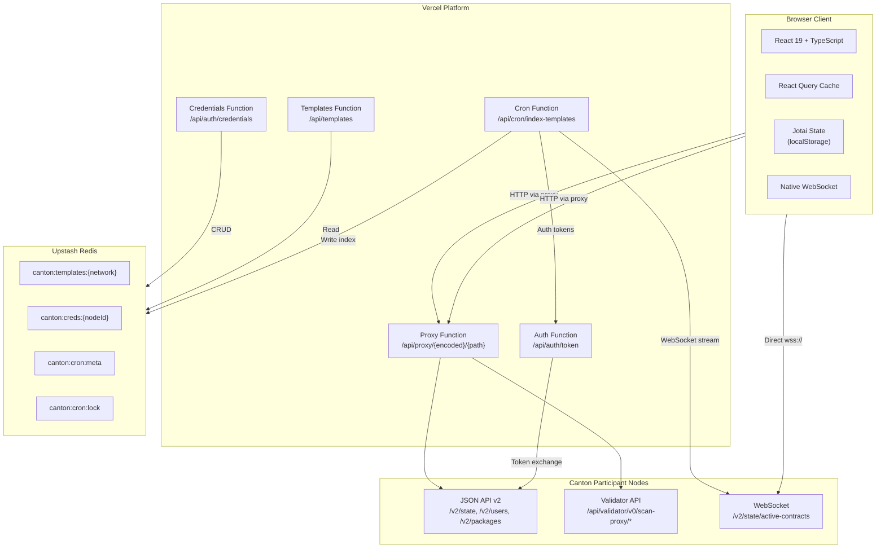
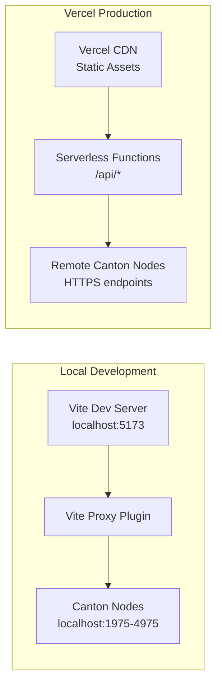
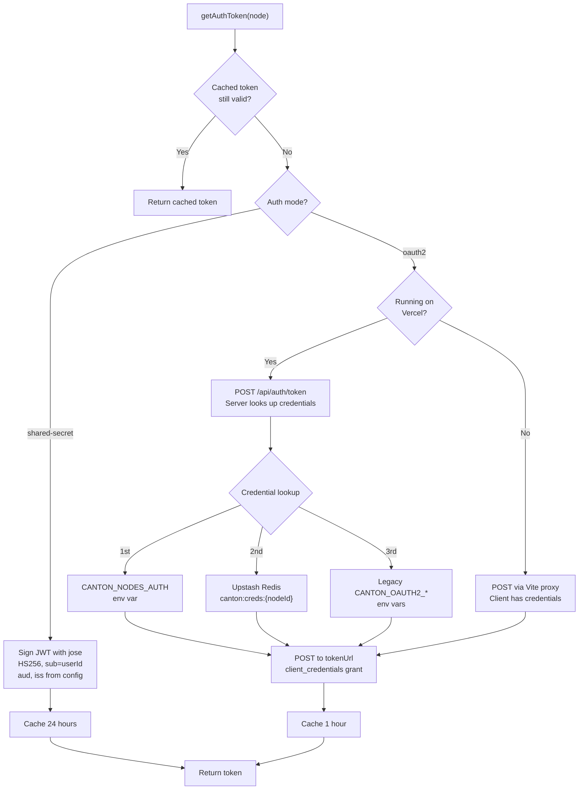
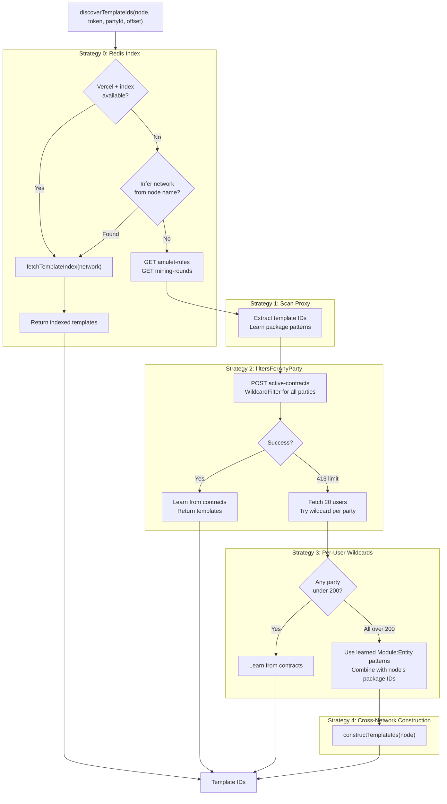
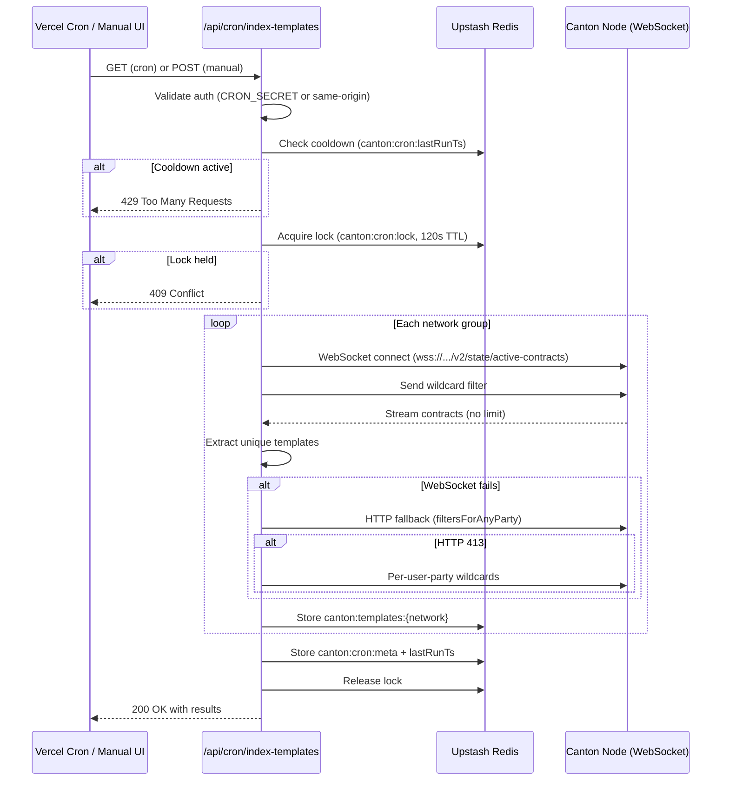
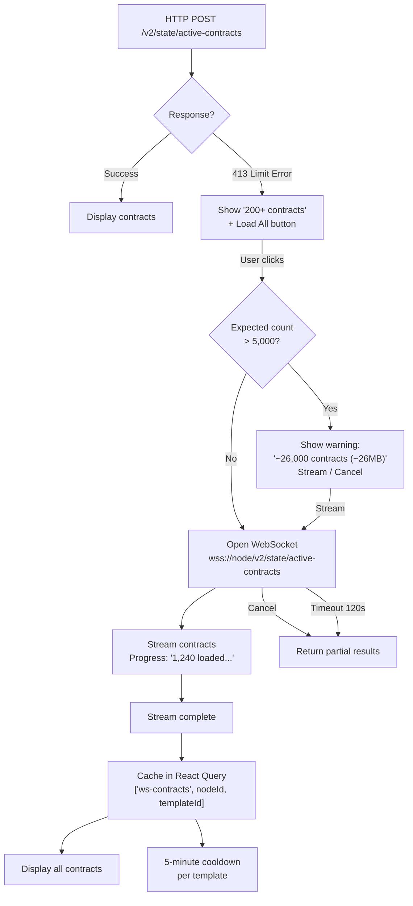
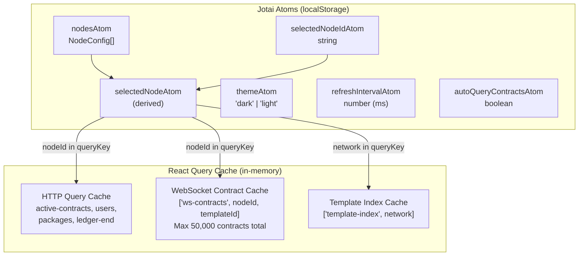

# System Architecture

Canton Local Inspector is a React dashboard for inspecting Canton Network participant nodes. It connects to Canton JSON API v2, Validator Scan Proxy, and WebSocket streaming endpoints to browse synchronizers, parties, packages, and active contracts.

## High-Level Architecture



## Deployment Modes



| Component | Local Dev | Vercel Production |
| --------- | --------- | ----------------- |
| API Proxy | Vite dev proxy (`/proxy/remote/...`) | Serverless function (`/api/proxy/...`) |
| OAuth2 Token | Client-side via Vite proxy | Serverless function (`/api/auth/token`) |
| Client Secrets | In browser (dev only) | Upstash Redis (server-side) |
| Template Index | Live discovery on demand | Cron job + Redis cache |
| WebSocket | Direct `ws://localhost:port` | Direct `wss://remote-host` |
| Node Config | Quickstart local nodes | `VITE_NODES` env var |

## Authentication Architecture



### Validator Token

The Validator/Scan Proxy API may require a different audience than the JSON API. `getValidatorAuthToken()` handles this:

- If `validatorAudience` is configured: fetches a separate token with that audience
- Otherwise: reuses the main JSON API token
- Cached separately under key `{nodeId}:validator`

## Template Discovery



### Cross-Network Pattern Learning

Template discovery learns `packageName` to `Module:Entity` mappings from every successful query. These are namespaced by network to prevent mixing:

```text
knownTemplatePatterns = {
  "devnet": {
    "splice-amulet": ["Splice.Amulet:Amulet", "Splice.Round:OpenMiningRound", ...],
    "splice-wallet": ["Splice.Wallet.Install:WalletAppInstall"]
  },
  "mainnet": {
    "splice-amulet": ["Splice.Amulet:Amulet", ...],
    "kairo-dex-simple-escrow-v3": ["Kairo.Escrow.TradeProposal:TradeProposal", ...]
  }
}
```

## Cron-Based Template Indexing



## WebSocket Streaming



### Mixed Content Handling

WebSocket connections from an HTTPS page to a non-TLS Canton node (`ws://`) are blocked by browser security. The system detects this and shows a clear error message instead of failing silently.

## State Management



### React Query Cache Eviction

The WebSocket contract cache enforces a 50,000-contract cap across all cached templates per node:

```text
Before caching new stream (e.g., 3,631 AmuletAllocation contracts):
  1. Count total cached contracts for this node
  2. If total + new > 50,000:
     a. Sort existing entries by updatedAt (oldest first)
     b. Evict oldest entries until under limit
  3. Store new entry
```

## Project Structure

```text
canton-local-inspector/
  src/
    api/canton.ts              Client API (auth, proxy, discovery, WebSocket streaming)
    types/canton.ts            TypeScript interfaces
    constants/nodes.ts         Node config from env vars
    stores/nodeStore.ts        Jotai atoms (persisted to localStorage)
    hooks/useCantonQuery.ts    React Query hooks
    components/
      ui/                      shadcn/ui primitives
      common/                  AutocompleteInput, LoadAllButton, JsonViewer, CopyButton, etc.
      layout/                  Sidebar, Header, NodeSelector
    pages/
      OverviewPage.tsx         Network health and stats
      SynchronizerPage.tsx     DSO contracts and party grid
      PartiesPage.tsx          Users, network parties, party lookup
      PackagesPage.tsx         Packages with template counts
      ContractsPage.tsx        Contract explorer (3 query modes)
      SettingsPage.tsx         Node config, auth, template index status

  api/                         Vercel Serverless Functions
    auth/token.ts              OAuth2 token exchange
    auth/credentials.ts        Dynamic node credential CRUD
    cron/index-templates.ts    Daily template indexing (WebSocket)
    proxy.ts                   Canton API proxy
    templates.ts               Cached template index reader

  docs/                        Documentation
  vercel.json                  Deployment config with cron schedule
```
