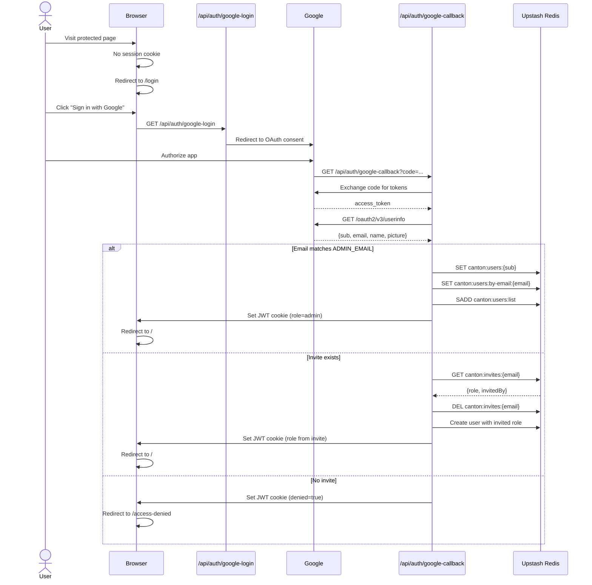

# Authentication and User Management

Canton Local Inspector uses Google OAuth for user authentication and an invite-only access model with role-based permissions.

## Overview

```mermaid
flowchart TD
    USER["User visits site"] --> CHECK{"Vercel deployment?"}
    CHECK -->|No (local dev)| MOCK["Auto-authenticated<br/>as mock admin"]
    CHECK -->|Yes| SESSION{"Session cookie<br/>exists?"}
    SESSION -->|No| LOGIN["Redirect to /login"]
    SESSION -->|Yes| VERIFY["Verify JWT cookie<br/>(GET /api/auth/session)"]
    VERIFY -->|Valid + role assigned| DASHBOARD["Access granted<br/>Role-based UI"]
    VERIFY -->|Valid + denied flag| DENIED["/access-denied page"]
    VERIFY -->|Invalid/expired| LOGIN
    LOGIN -->|Click 'Sign in with Google'| GOOGLE["Google OAuth<br/>consent screen"]
    GOOGLE -->|Authorize| CALLBACK["/api/auth/google-callback"]
    CALLBACK --> LOOKUP{"User authorized?"}
    LOOKUP -->|ADMIN_EMAIL match| CREATE_ADMIN["Create admin user<br/>in Redis"]
    LOOKUP -->|Invite exists| CREATE_INVITED["Create user with<br/>invited role, delete invite"]
    LOOKUP -->|Neither| DENIED_COOKIE["Set denied cookie<br/>Redirect to /access-denied"]
    CREATE_ADMIN --> SET_COOKIE["Set JWT session cookie<br/>(24h, HttpOnly, Secure)"]
    CREATE_INVITED --> SET_COOKIE
    SET_COOKIE --> DASHBOARD
```

## Access Model

**Invite-only**: Only users explicitly invited by an admin (or matching the `ADMIN_EMAIL` env var) can access the application. All others see an "Access Denied" page after Google sign-in.

## Roles

| Role | Browse Pages | Modify Settings | Trigger Indexing | Manage Users |
| ---- | ------------ | --------------- | ---------------- | ------------ |
| Admin | Yes | Yes | Yes | Yes |
| Editor | Yes | Yes | Yes | No |
| Viewer | Yes | No | No | No |

## Authentication Flow

### Google OAuth



### Session Management

- **JWT cookie**: `canton-session`, signed with `AUTH_SECRET` via HS256 (jose library)
- **HttpOnly + Secure + SameSite=Lax**: Cannot be read by JavaScript, HTTPS only
- **24-hour expiry**: User re-authenticates daily
- **Role refresh**: `GET /api/auth/session` reads the JWT but refreshes the role from Redis on every call, so admin role changes take effect immediately
- **Polling**: Client polls `/api/auth/session` every 5 minutes to detect role changes or session expiry

### Local Development Bypass

When `VITE_DEPLOY_ENV !== 'vercel'`:

- `AuthProvider` returns a mock admin user immediately
- No session fetch, no Google OAuth credentials needed
- All pages accessible, all features enabled
- `ProtectedRoute` always renders children

## User Management

### Admin Panel (`/admin/users`)

Accessible only to users with the `admin` role. Provides:

**Invite New User:**

- Enter email + select role (viewer or editor)
- Creates `canton:invites:{email}` in Redis
- User activates by signing in with Google

**Active Users List:**

- Shows all registered users with avatar, name, email, role, last login
- Admin can change any user's role via dropdown
- Admin can revoke access (deletes user from Redis)
- Admin cannot demote or remove themselves

**Pending Invites:**

- Shows unaccepted invitations
- Admin can revoke pending invites

### Admin API Endpoints

All endpoints verify the caller is an admin by checking the JWT session cookie.

| Method | Path | Purpose |
| ------ | ---- | ------- |
| GET | `/api/admin/users` | List all registered users |
| PATCH | `/api/admin/users` | Change user role `{userId, role}` |
| DELETE | `/api/admin/users` | Revoke user access `{userId}` |
| GET | `/api/admin/invites` | List pending invites |
| POST | `/api/admin/invites` | Create invite `{email, role}` |
| DELETE | `/api/admin/invites` | Revoke invite `{email}` |

## Redis Schema

All user data is stored in Upstash Redis alongside existing Canton data:

```text
canton:users:{googleId}           JSON {email, name, image, role, createdAt, lastLoginAt}
canton:users:by-email:{email}     String (googleId lookup index)
canton:users:list                 Set of googleIds (for listing all users)
canton:invites:{email}            JSON {role, invitedBy, createdAt}
canton:invites:list               Set of emails (for listing pending invites)
```

## Environment Variables

| Variable | Required | Description |
| -------- | -------- | ----------- |
| `GOOGLE_CLIENT_ID` | Yes (Vercel) | Google OAuth client ID |
| `GOOGLE_CLIENT_SECRET` | Yes (Vercel) | Google OAuth client secret |
| `AUTH_SECRET` | Yes (Vercel) | Secret for signing JWT session cookies |
| `ADMIN_EMAIL` | Yes (first deploy) | Email of the initial admin user |

### Google OAuth Setup

1. Go to [Google Cloud Console](https://console.cloud.google.com/apis/credentials)
2. Create OAuth 2.0 Client ID (Web application)
3. Add authorized redirect URI: `https://your-domain.com/api/auth/google-callback`
4. Copy Client ID and Client Secret to Vercel env vars

## Security Considerations

- **No client-side secrets**: Google client secret is server-side only
- **HttpOnly cookies**: Session token cannot be stolen via XSS
- **Role verification**: Every `/api/auth/session` call refreshes the role from Redis, so admin changes (promote/demote/revoke) take effect within 5 minutes
- **Invite consumption**: Invites are deleted from Redis on first use (one-time activation)
- **Admin self-protection**: Admin cannot demote or remove themselves
- **CSRF protection**: SameSite=Lax cookie attribute prevents cross-site request forgery
