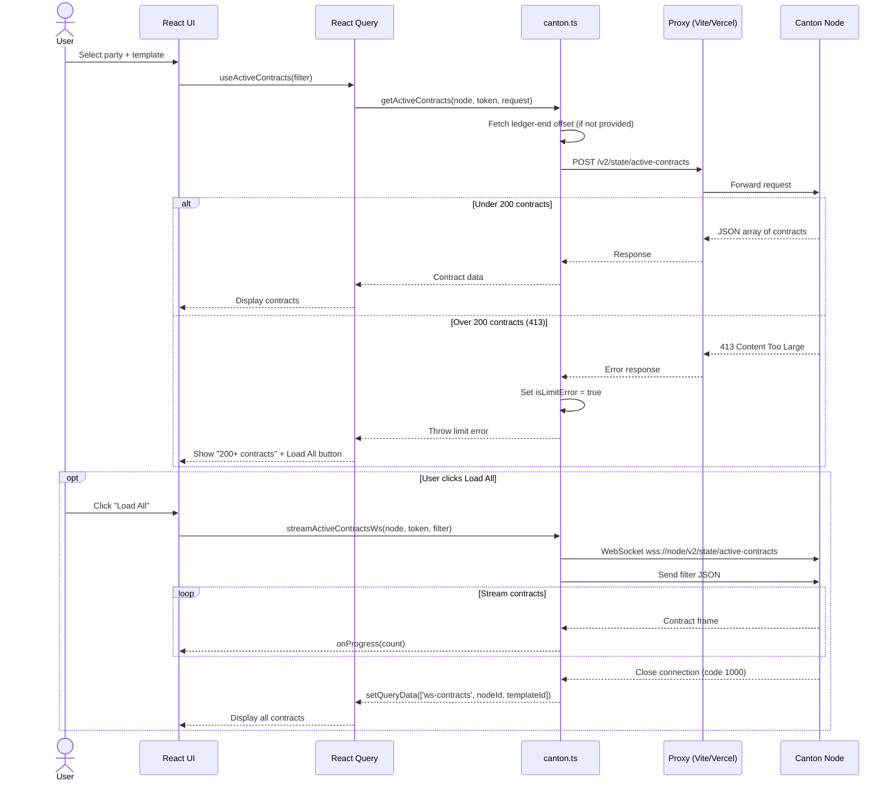
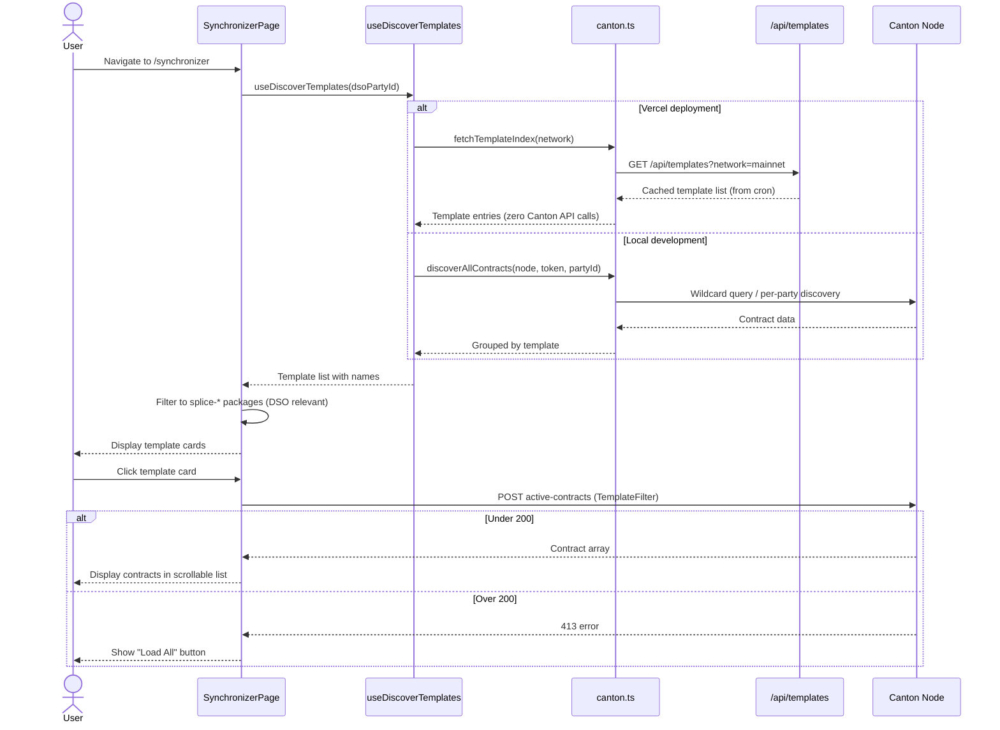
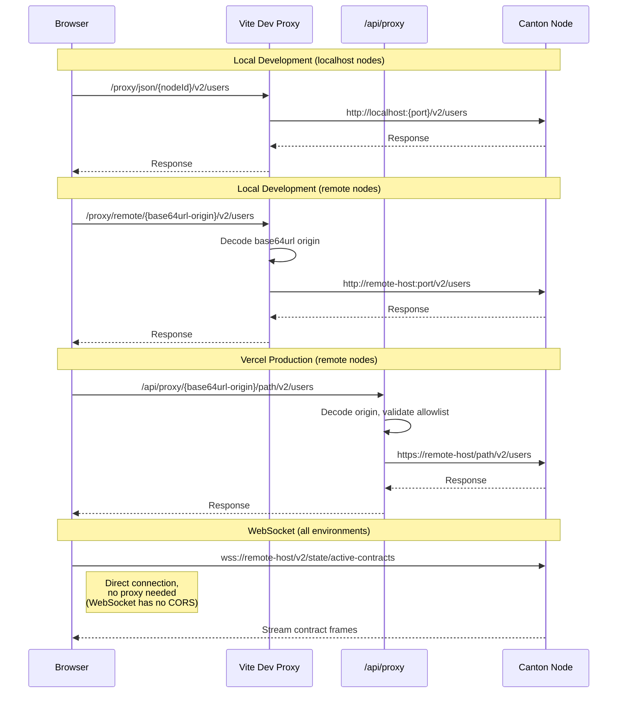
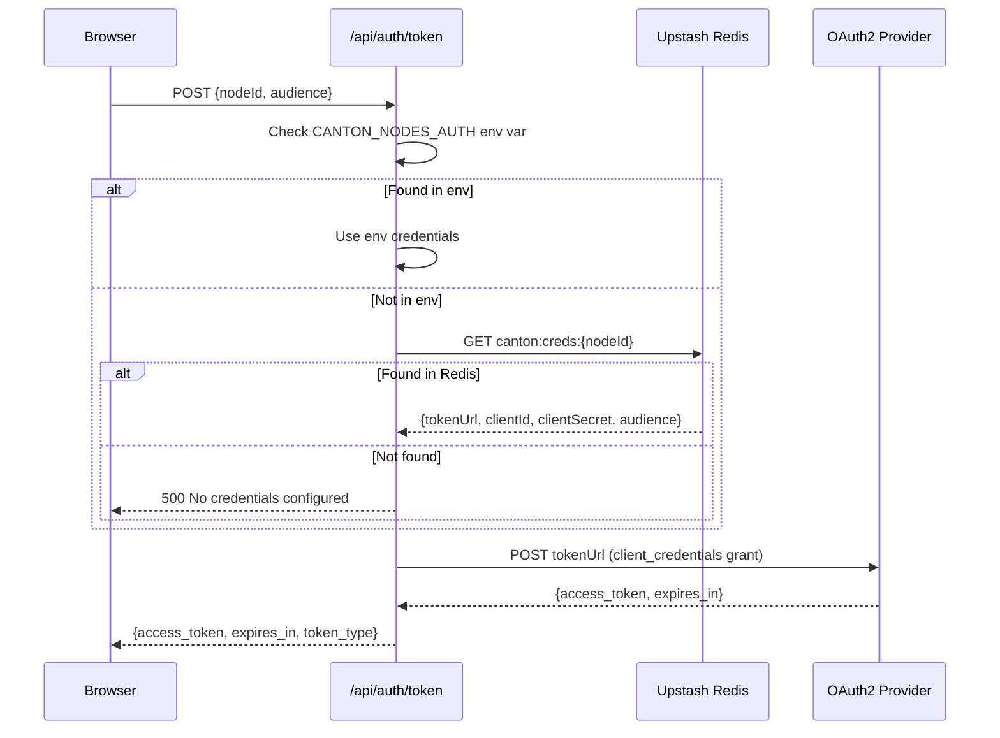
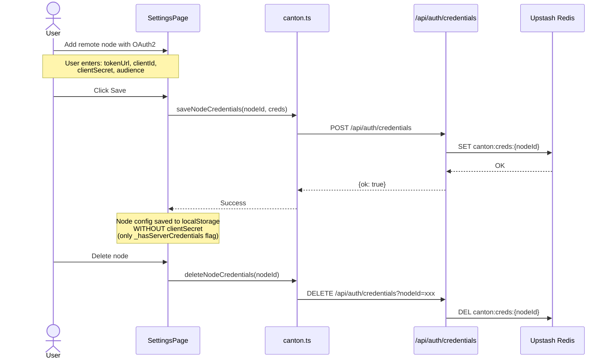
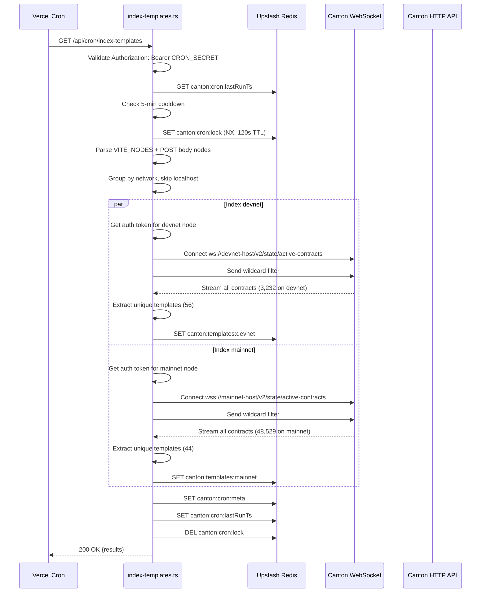
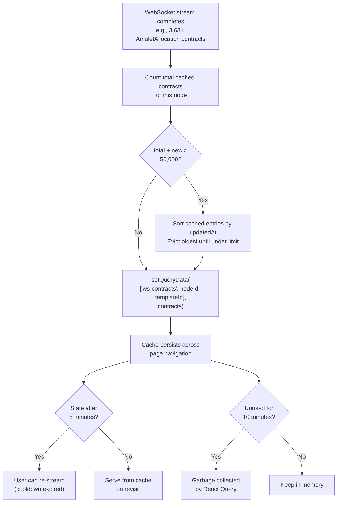

# Data Flows

Detailed sequence diagrams for the key data flows in Canton Local Inspector.

## Contract Query Flow

The primary user interaction: querying active contracts for a party and template.

## Synchronizer Page Load

The Synchronizer page uses the cached template index and queries contracts per template.

## Proxy Routing

How API requests reach Canton nodes in different environments.

## OAuth2 Token Exchange

How tokens are obtained for remote Canton nodes with OAuth2 authentication.

## Dynamic Node Credential Storage

How OAuth2 credentials for dynamically-added nodes are securely stored.

## Cron Template Indexing

The daily cron job that pre-builds the template index.

## WebSocket Contract Cache Lifecycle

How streamed contracts are cached and evicted in React Query.

